# Chart types

The same numbers can be shown in several ways, it is up to you to select the one that ensures your message is clear and accurate.

| Use a table                                                                           | Use a chart                                                                           |
| ------------------------------------------------------------------------------------- | ------------------------------------------------------------------------------------- |
| To allow comparison of precise, individual values                                     | To give an overview, when precise individual values aren't necessary                  |
| To show multiple units of measure (e.g. n and %)                                      | To show relationships in the data                                                     |
| To show values and their sums                                                         | To highlight patterns and trends                                                      |

## Which chart to use?

Make sure you are answering intelligent, useful and practical questions with your charts; consider quality not quantity. Use your questions as a starting point to help you think about the most appropriate chart type. We have provided flow charts to help you make the right decision based on your data and your product's purpose.

### Demonstrate deviation
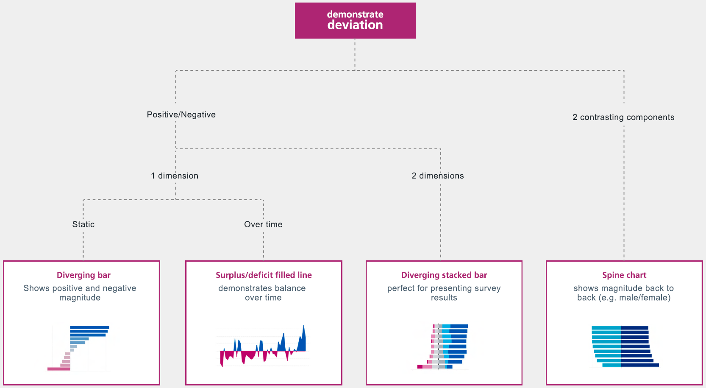{ data-title="Demonstrate deviation" data-description=".custom-desc1" data-caption-position="left" data-gallery="charts"}

<ul>
    <li>Diverging bar</li>
    <li>Surplus/deficit filled line</li>
    <li>Diverging stacked bar</li>
    <li>Spine chart</li>
</ul>

### Better understand relationships
{ data-title="Better understand relationships" data-description=".custom-desc2" data-caption-position="left" data-gallery="charts"}

<ul>
    <li>Line + Column</li>
    <li>Connected scatter plot</li>
    <li>Scatter plot</li>
    <li>Bubble chart</li>
    <li>XY heatmap</li>
</ul>

### Understand flow
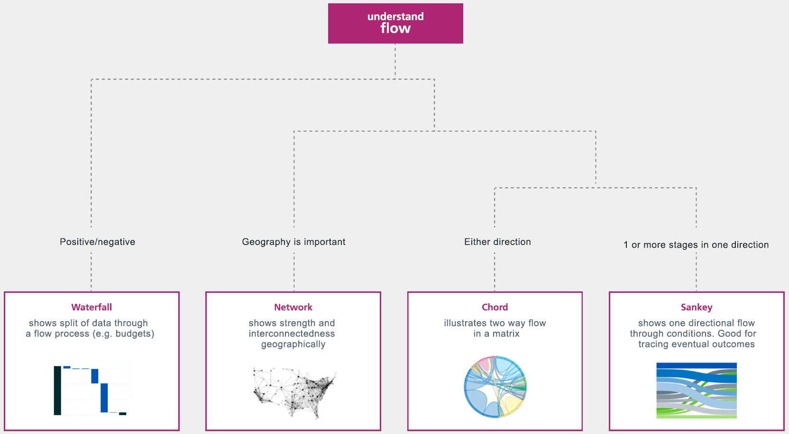{ data-title="Understand flow" data-description=".custom-desc3" data-caption-position="left" data-gallery="charts"}

<ul>
    <li>Waterfall</li>
    <li>Network</li>
    <li>Chord</li>
    <li>Sankey</li>
</ul>

### Show rank
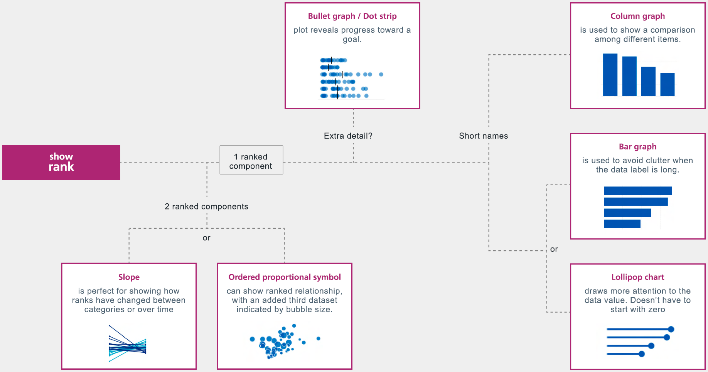{ data-title="Show rank" data-description=".custom-desc4" data-caption-position="left" data-gallery="charts"}

<ul>
    <li>Slope</li>
    <li>Ordered proportional symbol</li>
    <li>Bar graph</li>
    <li>Lollipop chart</li>
    <li>Column graph</li>
    <li>Bullet graph/Dot strip</li>
</ul>

### Analyse trends
=== "Analyse trends"

    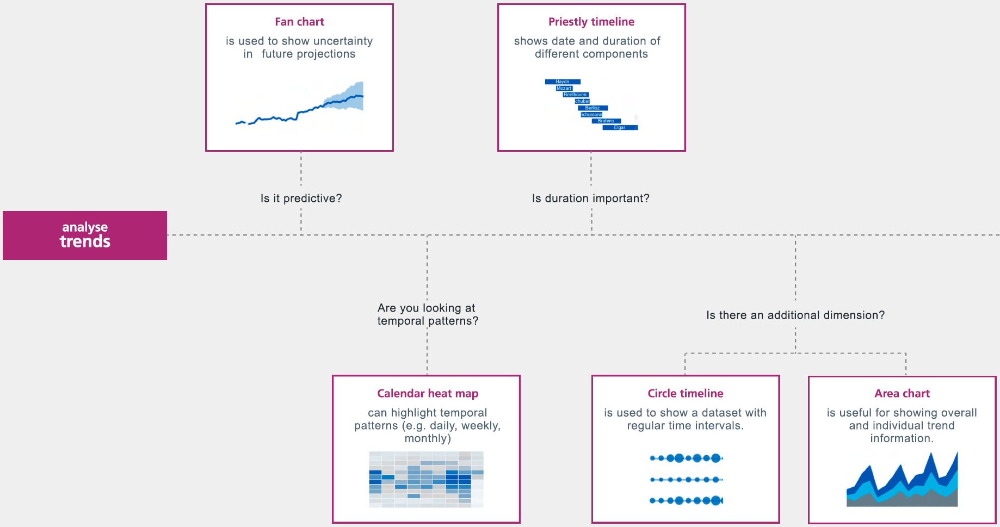{data-title="Analyse trends" data-description=".custom-desc5" data-caption-position="left" data-gallery="charts"}

=== "continued"

    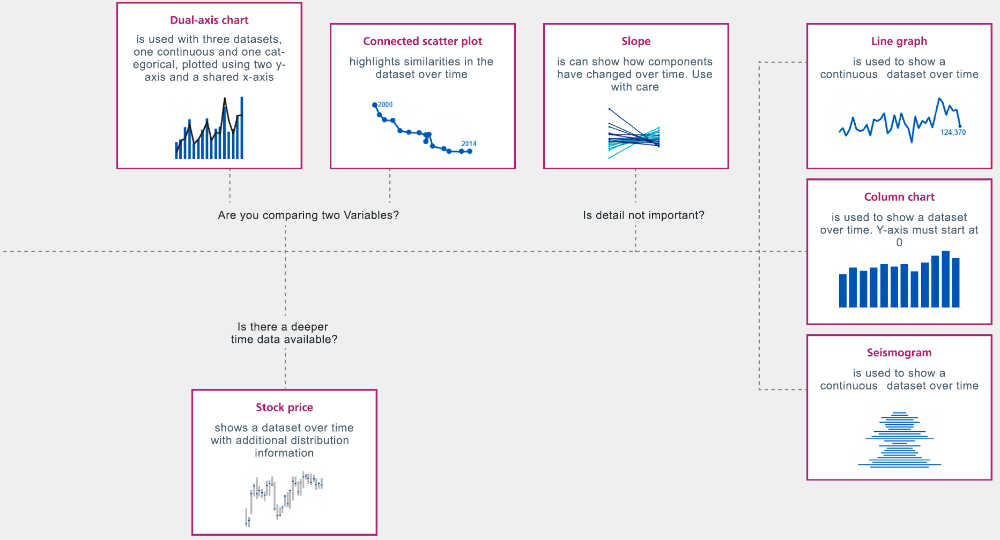{data-title="Analyse trends continued" data-description=".custom-desc5" data-caption-position="left" data-gallery="charts"}

<ul>
    <li>Fan chart</li>
    <li>Calendar heatmap</li>
    <li>Priestly timeline</li>
    <li>Circle timeline</li>
    <li>Area chart</li>
    <li>Dual-axis chart</li>
    <li>Connected scatter plot</li>
    <li>Stock price</li>
    <li>Slope</li>
    <li>Line graph</li>
    <li>Column chart</li>
    <li>Seismogram</li>
</ul>

### Understand the distribution
{data-title="Understand the distribution" data-description=".custom-desc6" data-caption-position="left" data-gallery="charts"}

<ul>
    <li>Dot plot</li>
    <li>Barcode plot</li>
    <li>Dot strip plot</li>
    <li>Box plot</li>
    <li>Violin plot</li>
    <li>Histogram</li>
    <li>Population pyramid</li>
    <li>Cumulative curve</li>
</ul>

### Show composition
=== "Show composition"

    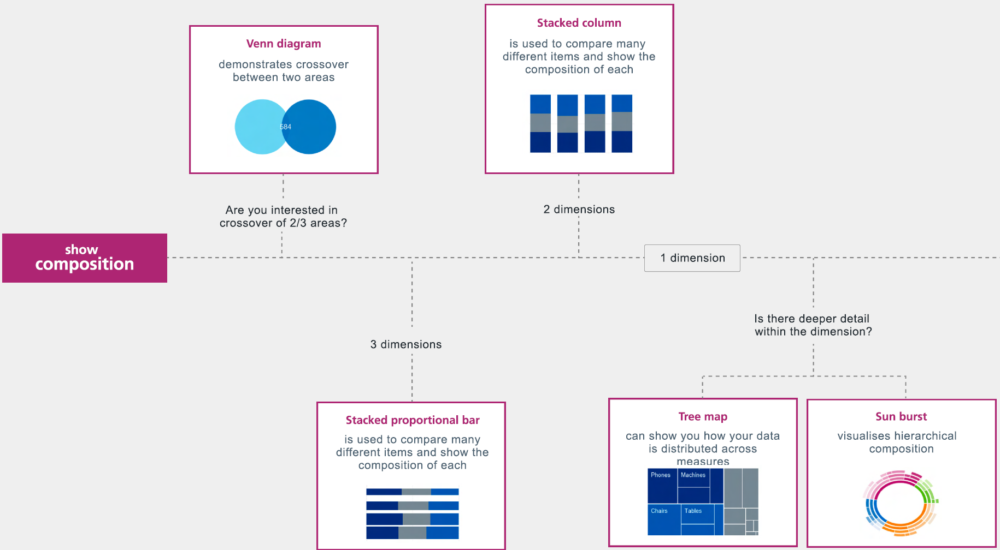{data-title="Show composition" data-description=".custom-desc7" data-caption-position="left" data-gallery="charts"}

=== "continued"

    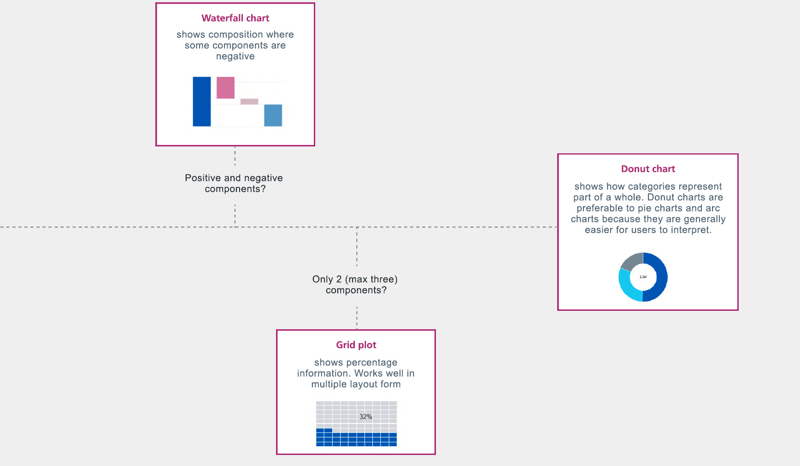{data-title="Show composition continued" data-description=".custom-desc7" data-caption-position="left" data-gallery="charts"}

<ul>
    <li>Venn diagram</li>
    <li>Stacked proportional bar</li>
    <li>Stacked column</li>
    <li>Tree map</li>
    <li>Sunburst</li>
    <li>Waterfall chart</li>
    <li>Grid plot</li>
    <li>Arc/pie chart</li>
    <li>Donut chart</li>
</ul>

### Demonstrate magnitude
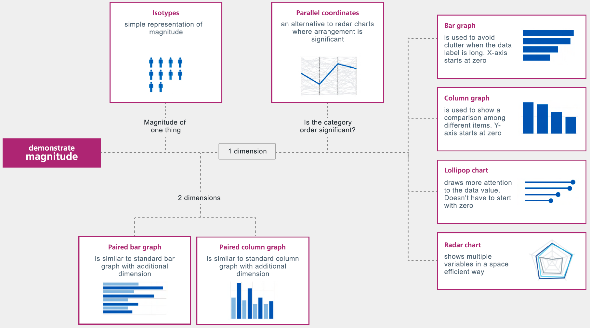{ data-title="Demonstrate magnitude" data-description=".custom-desc8" data-caption-position="left" data-gallery="charts"}

<ul>
    <li>Isotypes</li>
    <li>Paired bar graph</li>
    <li>Paired column graph</li>
    <li>Parallel coordinates</li>
    <li>Bar graph</li>
    <li>Column graph</li>
    <li>Lollipop chart</li>
    <li>Radar chart</li>
</ul>

### Geographical patterns
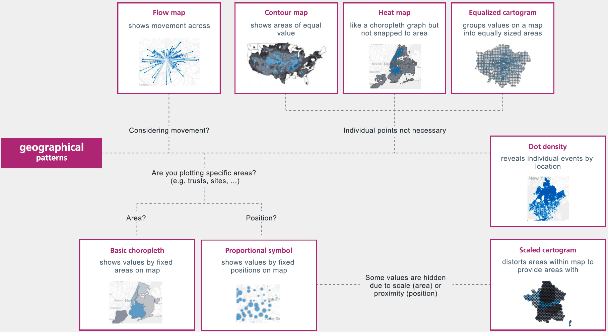{ data-title="Geographical patterns" data-description=".custom-desc9" data-caption-position="left" data-gallery="charts"}

<ul>
    <li>Flow map</li>
    <li>Basic choropleth</li>
    <li>Proportional symbol</li>
    <li>Contour map</li>
    <li>Heat map</li>
    <li>Dot density</li>
    <li>Scaled cartogram</li>
    <li>Equalized cartogram</li>
</ul>

!!! note "Useful links"

    - Visual vocabulary - Alan Smith, The Chart Doctor @Financial times

    - How to choose the right chart for your data - Infogram

    - Choosing the right chart
[comment]: <> (need actual links to add in!!)

## Data maps

Removing as much clutter as possible removes potential distractions from your data and makes everything easier to read.

!!! tip inline "Best practice"
    Forgo 'chart-junk'

    - For filled maps, you can get rid of everything in the map by setting washout to 100% in map layers

    - For unfilled maps, uncheck base to remove the water colour
    
&nbsp;

    
&nbsp;

    
&nbsp;

    
&nbsp;

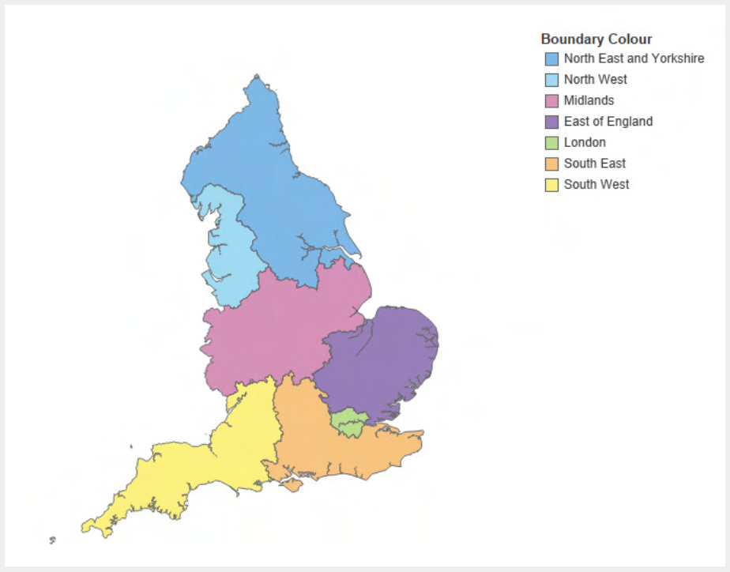{: width="63%" data-gallery="map"}

!!! note "Useful links"

    - See how data mapping has halted the epidemic - John Snow's cholera map
[comment]: <> (need actual links to add in!!)

## Showing national standards

National standards should be clearly labelled in charts wherever applicable. They should be shown with a black dashed (not dotted) line and "standard = n%" label.

<figure markdown>
  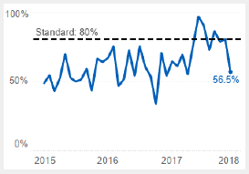{data-gallery="national"}
</figure>

## SPC charts

Approaches popular in the NHS, such as red, amber, green (RAG) rating and two point comparisions, have limitations for good decision-making.

<figure markdown>
  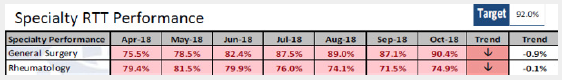{data-gallery="rtt"}
  <figcaption>An example RAG table</figcaption>
</figure>
<!-- 
Specialty RTT Performance (Target: 92.0%)
<table border="1" style="font-size:50%;">
    <tr>
        <th>
            Specialty Performance
        </th>
        <th>
            Jul-18
        </th>
        <th>
            Aug-18
        </th>
        <th>
            Sep-18
        </th>
        <th>
            Oct-18
        </th>
        <th>
            Trend
        </th>
        <th>
            Trend
        </th>
    </tr>
    <tr>
        <td>
            General Surgery
        </td>
        <td bgcolor="#DA291C">
            87.5%
        </td>
        <td bgcolor="#DA291C">
            89.0%
        </td>
        <td bgcolor="#DA291C">
            87.1%
        </td>
        <td bgcolor="#DA291C">
            90.4%
        </td>
        <td bgcolor="#DA291C" style="text-align: center">
            &#8595;
        </td>
        <td bgcolor="#DA291C">
            -0.9%
        </td>
    </tr>
    <tr>
        <td>
            Rheumatology
        </td>
        <td bgcolor="#DA291C">
            76.0%
        </td>
        <td bgcolor="#DA291C">
            74.1%
        </td>
        <td bgcolor="#DA291C">
            71.5%
        </td>
        <td bgcolor="#DA291C">
            74.9%
        </td>
        <td bgcolor="#DA291C" style="text-align: center">
            &#8595;
        </td>
        <td bgcolor="#DA291C">
            -0.1%
        </td>
    </tr>
</table> -->

The table above contains a lot of data but key messages such as "Are we improving or declining?" are very hard to determine.
These two specialities when viewed as an SPC chart with more data, show a more informative picture.
Clearly, conversations with these two specialties should be different, something the RAG table would not have suggested.

<figure markdown>
  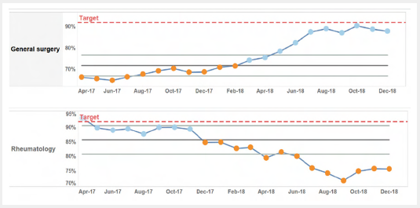{data-gallery="rtt"}
  <figcaption>An example SPC chart</figcaption>
</figure>

SPC charts will allow you to understand when something statistically significant is happening, caused by an external factor, rather than the natural variation of the system.
SPC can help to avoid tampering and the costs associated with it.
It can also help you to determine if, given the variance of the system, a target can be met and how reliably.
This will help to guide you when a system needs a complete re-design, an improvement cycle, or is in fact capable.
You can use SPC anywhere you have a metric that displays variance in between a time period. The data does not have to have a normal distribution.

**Caution:** Although there are many benefits to using SPC charts, they should also be applied with caution.
If there are situations where your data set displays seasonality, autocorrelation or small data sets, then additional research on how to construct an SPC accurately is necessary.
Caution should also be taken with users, as interpreting an SPC chart not only requires understanding on how to interpret SPC charts, but a proper knowledge of the data and it's relationship with other information to avoid incorrect conclusions. Consider whether including SPC will benefit the conversation.

!!! note "Useful links"

    - NHS England > Making data count
[comment]: <> (need actual links to add in!!)