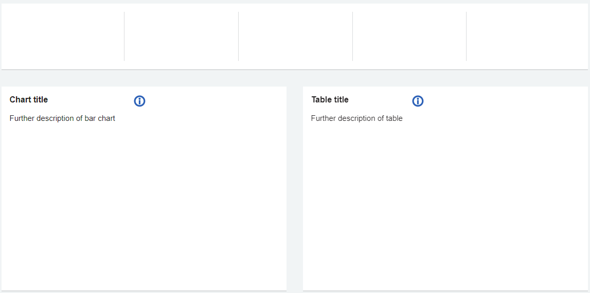
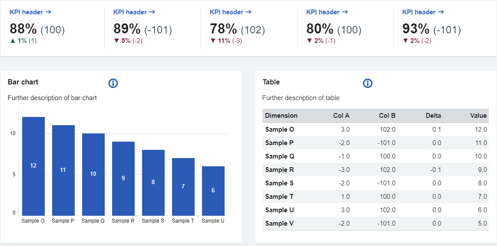

# Download NHS England Tableau templates

!!! warning "Start your dashboard journey here"
    All dashboard development must start with the empty templates, this will save time as the container structure, headers, chart titles, colours and logos are already in the correct place.

## Empty templates

!!! download "Empty templates download link"

    Download the empty templates by <a href="../../files/NHS_England_dashboard_templates_empty.twbx">clicking here</a>

**How to use the empty templates:**

These empty templates should be used when starting the development of your dashboard. 

1. Download the empty templates using the link above
2.  Open the .twbx file
3.  Connect to your datasource
4.  Remove the dummy datesource 
5.  Start developing!

***

Example of the empty template

{ data-title="Empty templates" data-description=".custom-desc2" data-caption-position="left" data-gallery="templates"}

Screenshot of the empty NHS England dashboard templates

## Populated templates

!!! download "Populated templates download link"

    Download the populated templates by <a href="../../files/NHS_England_dashboard_templates.twbx">clicking here</a>

**How to use the populated templates:**

These populated templates should be used as a guide as to how your dashboard could look. 

- [x]  'All items' dashboard shows a large range of elements that can be used in your dashboards. 
- [x]  Other dashboards in the workbook are example dashboard layouts that can be used as inspiration. 
- [x]  When you are ready to start developing your own dashboard, download the empty templates above. 
- [ ]  Do not use the populated templates to develop your dashboards. 

***

Example of the populated template

{ data-title="Populated templates" data-description=".custom-desc1" data-caption-position="left" data-gallery="templates"}

Screenshot of the populated NHS England dashboard templates

