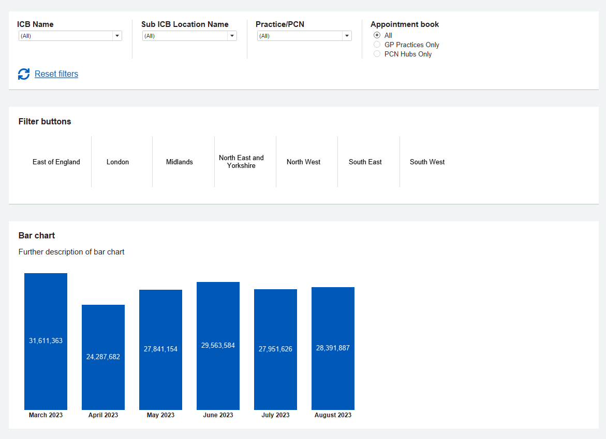
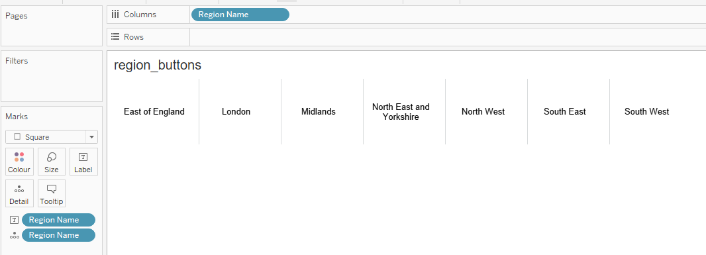
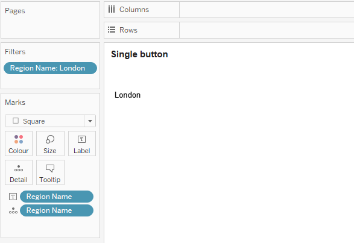
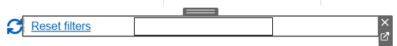
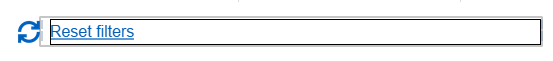
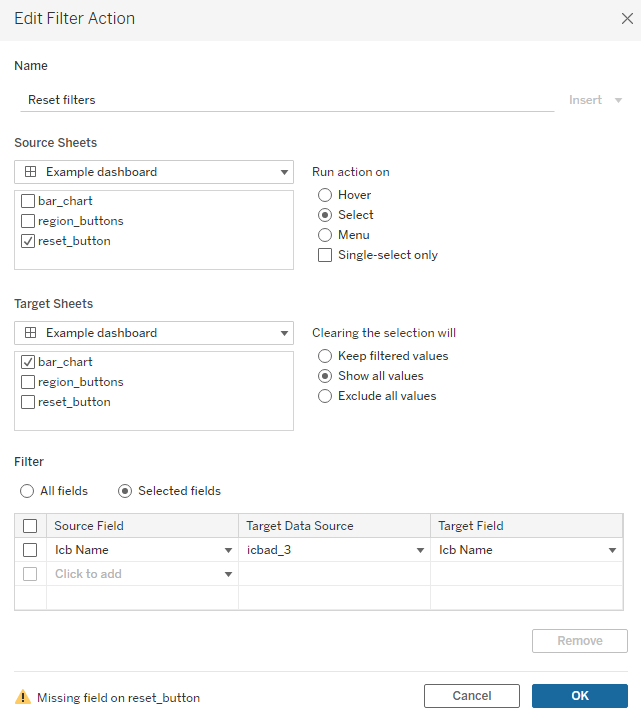

# Filters & buttons

{ data-title="Filters" data-description=".custom-desc1" data-caption-position="left" data-gallery="filters"}

Filters example

## Filters

!!! tip "Good practice"

    { width="400px" align=right data-title="Filters" data-description=".custom-desc2" data-caption-position="left" data-gallery="filters"}
    

    Selecting all dates in filter settings
    

    - Try to apply filters to all the views in one dashboard unless there is a strong reason to have seperate filters for each view. Users should not have to search around the page to cancel previous choices.

    - Make sure the values in the quick filter are ordered in a way that makes sense for your data. You can specify the order of a quick filter by setting the default sort order for that field.

    - If your user can make multiple selections within a filter dropdown the use an 'apply' button. This stops visualisations refreshing whilst the user is still choosing their selections.

    - Slider filters are great for date and numerical values, while list filters are better for categorical data. If your filter is continuous it may show date and times when published to prod, you can avoid this by making your date filter discrete with Day(Date), Month(Date) etc.

    - Discrete date filters can be set to the latest date value in the data source.

    - If your users require start and end date on the slider filter, this will not automatically update when new data comes through. To avoid this, instead of filtering on a range of dates, choose 'all dates' on the 'special' tab and turn the filter into a slider, as per the image below.
    

### Filters summary

- The filters on a dashbord should span across the width of the navigation line left aligned to the dashboard.
- Maximum of two rows (10 filters) should display on a dashboard. If more filters are required, then they should be included in the 'advanced filters' container.
- Filters should always show a reset link, which resets all of the filters applied including the advanced filters.
- When adding filters to a dashboard do not change the font colour and size on the worksheet. The font colour will be set in the template.
- Advanced filters button is optional and should be added only if there are more than 10 filters.

### Filters size, padding and colours

- All filters should be in equal width
- The filter card should be a white container with 16px inner padding and a 2px shadow (refer to <a href="../../dashboard_design/cards">cards page</a> for further details)
- The filters should be in a horizontal container within the card with a background colour of #d8dbdc
- The inner padding of each filter should be 16px left (apart from the further left filter) and 16px right
- Each filter should have a white background
- The outer padding of each filter should be 1px left (apart from the furthest left filter) to give the break lines
- The filter title should be arial, bold and size 11
- There can be any number of filters on a dashboard but a maximum of five should display in a row.

{ data-title="Filters size" data-description=".custom-desc3" data-caption-position="left" data-gallery="filters"}

Example of size of filters

**Filters - empty slot:**
- If there are <5 filters on a dashbouard, then the rest of the filter container slots should be left as empty and set a vairable width similar to the other filter containers

### Filter layout (two rows)
- Filters should always show a reset link, which resets all of the filters applied including the advanced filters.
- Only five filters should appear in a row for desktop, for 10 filters they have to split into two rows.
- When adding filters to a dashboard do not change the font colour and the size on the worksheet. The font colour will be set in the template.
- 'Advanced filters' button is optional and should only be added if there are more than 10 filters.

{ data-title="Filters two rows" data-description=".custom-desc4" data-caption-position="left" data-gallery="filters"}

Example of filters with two rows

### Filters with controls
- Dashboards may require extra Controls along with the filters. The purpose of the controls is to change the way the measures are being calculated. Eg: Absolute values, 7 day rolling average, Population rates.

- Note: Controls and filters will both work in conjunction to refine the data.

{ data-title="Filters with controls" data-description=".custom-desc5" data-caption-position="left" data-gallery="filters"}

Example of a filter with controls

### Filters with radio buttons & sliders
- Based on the data we populate on the dashboard, it may be required to use radio buttons and sliders as filters.

{ data-title="Filters" data-description=".custom-desc6" data-caption-position="left" data-gallery="filters"}

Example of filters with radio buttons & sliders

### Filters in context
- If any filters are applicable only for a certain vizualisation then those filters should sit within its card layout, as shown below.

{ data-title="Filters in context" data-description=".custom-desc1" data-caption-position="left" data-gallery="filters"}

Example of filters in context

### Advanced filters  - No information required
- This set of advanced filters does not require any information to explain all/any advanced filter.

{ data-title="Advanced filters - No information required" data-description=".custom-desc7" data-caption-position="left" data-gallery="filters"}

Example of advanced filters with no information required

### Advanced filters  - Short information required
- This set of advanced filters requires short information to explain all/any filter. The info should be shown in a tooltip should be shown in a tooltip when user clicks on the (i) icon.

{ data-title="Advanced filters - Short information required" data-description=".custom-desc8" data-caption-position="left" data-gallery="filters"}

Example of advanced filters with short information required

### Advanced filters  - Long information required
- This set of advanced filters requires long information to explain all/any filter

{ data-title="Advanced filters - Long information required" data-description=".custom-desc9" data-caption-position="left" data-gallery="filters"}

Example of advanced filters with long information required

## How to add a button on the dashboard

{ width="300px" align=right data-title="Button" data-description=".custom-desc10" data-caption-position="left" data-gallery="filters"}

Dashboard button

Tableau has an inbuilt button object used to navigate from one page to another within a dashboard.

1. You can use the 'navigation' object on the bottom left hand side.

2. Drag it to the dashboard like any other object.

3. Click the 'edit button' to define its attributes.

4. You can add this button as an image or as a text box.

5. Test it in the presentation mode to make sure it is working correctly.

!!! warning "Note if you edit the background colour of the button it will appear unchanged unless in presentation mode or on server."

## To use buttons as filters

This functionality is not part of the default tableau button above.
Generally, it is better to use inbuilt filters from columns, calculated fields or parameters as discussed above.
However, if you need a button to apply a filter on your dashboard, this can be achieved by creating a worksheet to appear like a button.

{ width="70%" data-gallery="button_filters"}

1.	Create a new worksheet, this will become your button.

2.	Use the square mark. (This stops the button highlighting as blue when the sheet is selected).

3.	Add the field you want to filter other worksheets by to the marks card e.g. as a detail.

4.	You can create several buttons on one worksheet by also adding the field to columns (left image).
Alternatively, if you are only having one button per worksheet you can add the field to the filters area and preselect the value you want the button to filter other worksheets to (right image).

    { width="55%" data-gallery="button_filters" align=left}
    { width="40%" data-gallery="button_filters" align=right}

5.	If you have a field in the columns section, then ensure you untick show headers.

6.	To add text to your button, use a label. This can be using the field or static text.

7.	Format the square colour to what you want the button to be. Eg white square with a grey border.

8.	Fit to entire view. You may need to increase the square size.

9.	If the square still appears behind text even when the square size is maxed, you can add “1” to the marks card as a colour, then edit the colour to what you want.
Now when the worksheet is selected the square will appear as a border instead.

10.	Add your button worksheet to your dashboard.

11.	Create a filter dashboard action.

    { width="70%" data-gallery="button_filters" align=left}

### Button to reset all filters in a dashboard

{: width="35% data-gallery="button_filters" align=right}

The method to use buttons as filters can also be used as a 'reset button'.

1.	Create a new worksheet, this will become your button.

2.	Use the square mark. (This stops the button highlighting as blue when the sheet is selected).

3.	To add text to your button, use a label. This can be using the field or static text.

4.	Fit to entire view.

5.	If the square still appears behind text even when the square size is maxed, you can add “1” to the marks card as a colour, then edit the colour to what you want.
Now when the worksheet is selected the square will appear as a border instead.

    { width="45%" data-gallery="button_filters" align=left}
    { width="45%" data-gallery="button_filters" align=right}

6.	Add any default values (for resetting parameters) to the marks card eg as details.

7.	Add your button worksheet to your dashboard.

8.	Create a filter dashboard action. Ensure the filters you want to unfilter are named in the selected fields section.
Ignore the missing field message. You can add as many filters as you want to reset to the single action.

9.	To unfilter/reset parameters to a default, create a change parameter dashboard action.
Ensure the default value you want to set the parameter to is placed in the source field and the clearing selection area.
You will need a parameter action per parameter you want to reset.

{ width="50%" data-gallery="button_filters" align=left}
{ width="45%" data-gallery="button_filters" align=right}

## Toggles (weighted data)

placeholder text