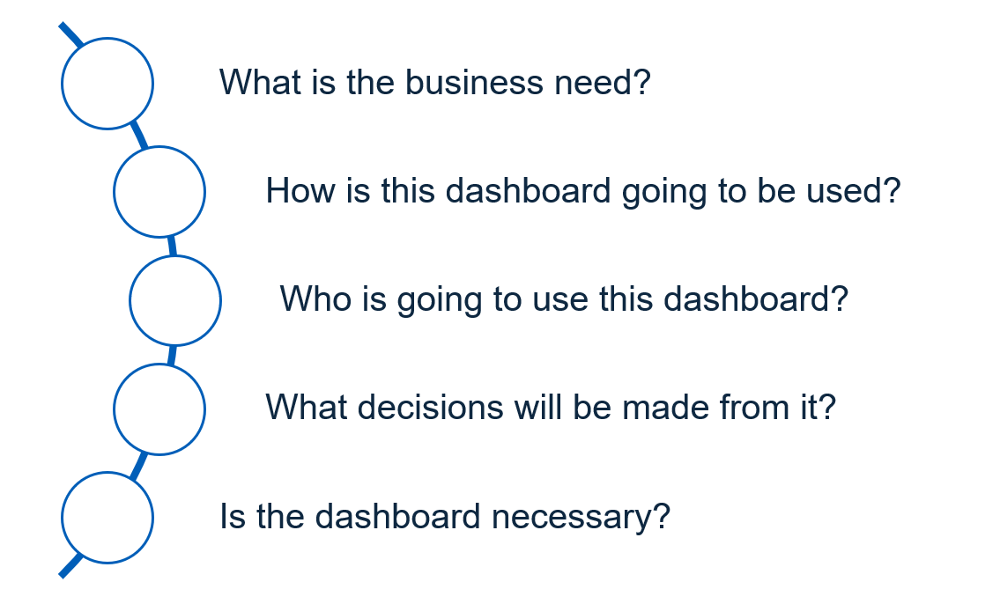

# Dashboard design

We convey our visual identity through the products we build. Design guidelines help us to work together on sophisticated digital products, using a standardised visual language. 

The NHS Identity is one of the most recognised and cherished brands in the world. It evokes trust and reassurance.

> Branding is the art of becoming knowable, likeable, and trustable.

> **John Jantsch**

A style guide helps us to ensure a continuous brand experience for our users. When style is applied consistently across NHS products, it fosters loyalty and trust across all user touch-points.

These guidelines are for developers, product owners and quality assurance testers working on data visualisation products in the NHS.

!!! quote "Quotes from users"

!!! note inline ""
    ** They've got the NHS blue - we can trust them. ** 
    *Public Research, 2015*

!!! note inline ""
    ** The NHS logo makes me feel that it is a service which I can trust. ** 
    *Public Research, 2015*

!!! note ""
    ** The logo says safe and secure. When I see that sign rather than another, I know that I’m in good hands wherever I am. ** 
    *Public Research, 2015*
    

## Benefits

These design guidelines are useful for:

- [x] **Creating trust**

    A clearly recognisable brand helps to engender trust that the product is authentic, and can help users to more easily identify of fraud / phishing attempts

- [x] **Delivering a consistent brand experience**

    Design guidelines specify the exact sizing and formatting requirements so that developers from different teams create products that are instantly recognisable as NHS products.

- [x] **Saving development time**

    Having one standard for data visualisation development teams aids collaboration. These guidelines are a tool which can be relied upon for quicker interaction times and consistent digital experiences for users.

- [x] **Faster onboarding**

    Having an agreed style guide will help new team members to get up to speed quickly and enable them to make design decisions, soon after joining us.

- [x] **Aligning to standards**

    Creating a unified visual experience across the product and considering how this links across analytical products will ensure a strong, professional and positive perception

## Dashboard purpose

You should think about the following questions before designing a dashboard:

{ data-title="Information / about page" data-description=".custom-desc1" data-caption-position="left" data-gallery="information"}

Questions to consider before designing a dashboard

If a dashboard is right for your project, consider it from the users perspective. Who are they? Could they benefit from a detailed report or one easy to read page? Think about the questions that each page will be answering and who would be asking the question. 