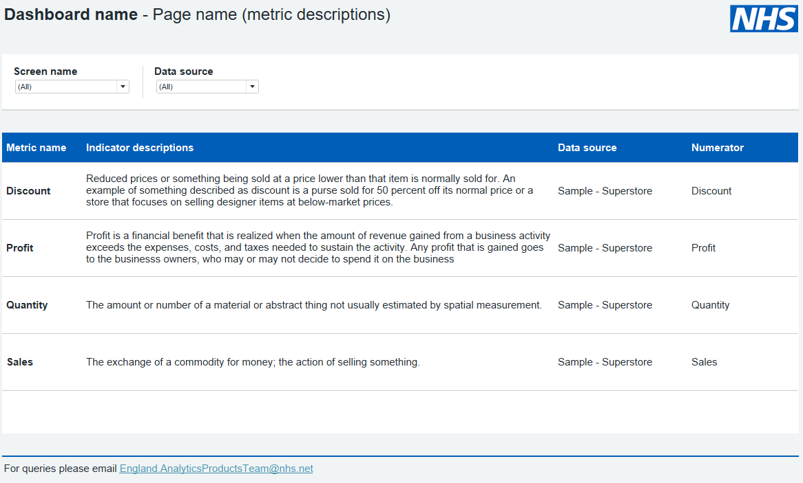

# Information and metric pages

For the user looking at your dashboard, context is everything. Information and metric pages provide context behind the dashboard's purpose and an overview of the information presented.

## Information / about page

'Information' or 'About' pages tell the user what the objectives of the dashboard are, which data sources it uses and the contact details for the team responsible.

???+ tip "Best practices"
    - [x] A brief description of the product
    - [x] A data source table showing data frequency, latest available data, refresh frequency, most recent refresh, and whether the data requires IG approval
    - [x] Auther: Team name. e.g. Analytics Product Development Team.
    - [x] Contact details: contact email of the relevant ream, e.g. england.analyticsproductsteam@nhs.net (add this as a URL link)
    - [x] Release number and year of creation
    - [x] Information on how to share the dashboard with colleagues should be included on this page

***

Example information page from the tableau templates:

{ data-title="Information / about page" data-description=".custom-desc1" data-caption-position="left" data-gallery="information"}

Example of an Information / About page

## Metric descriptions page

Analytical users want to better understand the data behind the graphs and tables they consume. For this purpose, it is best practice to add a metric desciption tab.

???+ tip "Table best practices"
    - [x] Include display name
    - [x] Include description
    - [x] Include numerator
    - [x] Include denominator
    - [x] Include calculation details of each metric

***

Example metric description page from the tableau templates:

{ data-title="Metric descriptions page" data-description=".custom-desc1" data-caption-position="left" data-gallery="information"}

Example of a metric descriptions page

