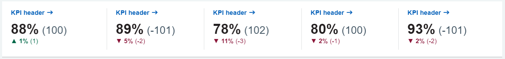
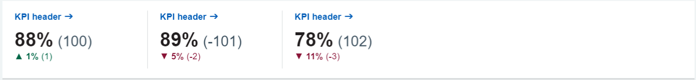
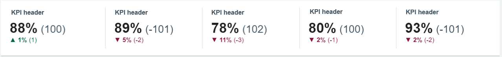
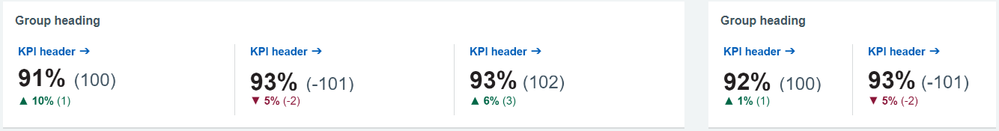

# KPIs
KPIs provide key information to the user at a single glance.

## Best Practices

???+ tip "KPIs - Best practices"
    - [x] The width of the KPI slots should change based on the screen size (not the spacing between them). The space between each KPI slot should always be 8px.
    - [x] If there is any description available for the KPIs that has to be shown in a tooltip on rollover the KPI slot.
    - [x] There can be any number of KPIs shown on a dashboard (we suggest not more than a total of 10) and a maximum of five slots should be allocated per row to display the KPIs.
    - [x] If there are <5 KPIs then we use blank spaces for the remaining slots out of five.
    - [x] 
If a KPI slot has a click-through, then its metric title should appear in NHS Blue #005EB8 along with an arrow

    - [x] 
If a KPI slot does not have a click-through, then its metric title should be in NHS Dark Grey #425563 without an arrow

    - [ ] There should not be a mix of interactive and non-interactive KPIs on the dashboard
    - [x] Titles for KPIs will be pulled dynamically from the data, so during the testing, if we notice the titles are long then increase the height of these KPI slots.

{ data-title="KPI example" data-description=".custom-desc1" data-caption-position="left" data-gallery="kpi"}

Annotated KPI

## KPIs per row
There can be any number of KPIs appear on dashboards (we suggest not more than 10), but a maximum of five slots and a minimum of four should be allocated per row to display the KPIs.

{ data-title="KPIs per row" data-description=".custom-desc2" data-caption-position="left" data-gallery="kpi"}

Example of number of KPIs in a row

## KPIs with long titles
Refer to the templates for container set-up and padding specification

{ data-title="KPIs per row" data-description=".custom-desc3" data-caption-position="left" data-gallery="kpi"}

Example of KPIs with long titles

## KPIs per row - empty slots

If there are <5 KPIs then the remaining slots out of five should be left as blank.

{ data-title="KPIs per row" data-description=".custom-desc4" data-caption-position="left" data-gallery="kpi"}

Example of number of KPIs with empty slots

## KPIs variations

### Interactive KPIs

If a KPI slot has a click-through, then its title should appear in NHS Blue #005EB8 along with an arrow.

{ data-title="Interactive KPIs" data-description=".custom-desc5" data-caption-position="left" data-gallery="kpi"}

Example of interactive KPIs

### Non-interactive KPIs

If a KPI slot does not have a click-through it should be in NHS Dark Grey #425563 without an arrow.

{ data-title="Non interactive KPIs" data-description=".custom-desc6" data-caption-position="left" data-gallery="kpi"}

Example of non interactive KPIs

## KPIs grouping
5 KPIs should be spread across the screen. When there is a mixed scenario of grouped KPIs and individual KPIs then you must to leave an extra space on the top of the slot.
If possible arrange the groups first followed by the individual KPIs.

{ data-title="KPIs grouping" data-description=".custom-desc7" data-caption-position="left" data-gallery="kpi"}

Example of grouped KPIs

