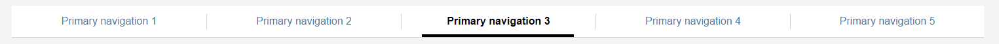
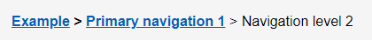

# Navigation

Where NHS England dashboards are embedded into web pages it is best to make use of the existing web wrapper via the [NHS England apps model portal](https://apps.model.nhs.uk/), this makes use of the 'showing sheets as tabs' Tableau navigation function.
Where this web wrapper is not available, or two tier navigations are required it is best to use Tableau navigation buttons instead.

## Web wrapper

NHS England apps model portal web wrapper

{data-title="Web wrapper" data-caption-position="top" data-gallery="wrapper"}

Tableau developers should build their dashboard pages from beneath the web wrapper navigation tabs. In the image below, the top part in grey overlay is the web wrapper, the rest is built in Tableau.

{data-title="The web wrapper meets Tableau" data-caption-position="top" data-gallery="wrapper"}

## Navigation buttons

Where the web wrapper is not available or a two tier navigation is required, use the navigation buttons.

**Single tier navigation:**

{data-title="Single tier navigation" data-caption-position="top" data-gallery="wrapper"}

**Double tier navigation:**

{data-title="Double tier navigation" data-caption-position="top" data-gallery="wrapper"}

!!! warning "Use the templates examples to create navigation buttons"

    The easiest way to create the single and double tier navigation is to copy the examples directly from the [templates](../download_templates).

## Other forms of navigation

**Tabs as navigation**

Including default tabs is the quickest, easiest way to allow users to navigate the dashboard. They are used in many products so users will be accustomed to using them naturally and they maximise space simply. We would advise this method. It is ideal not to have more than eight tabs.

**KPIs / Visualisation as navigation**

Users should be able to navigate through dashboards by clicking on the KPIs or on any areas within the visualisations.

**Hyperlinks**

Add hyperlinks to websites with more information (such as the HES Data Dictionary or published data on the NHS England website) or on the cover/about page.

**Breadcrumbs**

Using breadcrumbs can help a user locate where they are in the dashboard and can be a shortcut to higher level pages.

{data-title="Breadcrumbs" data-caption-position="top" data-gallery="wrapper"}
