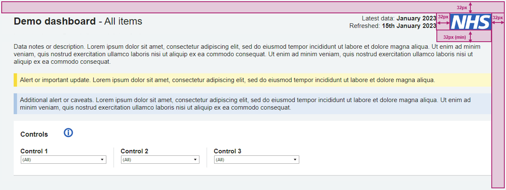
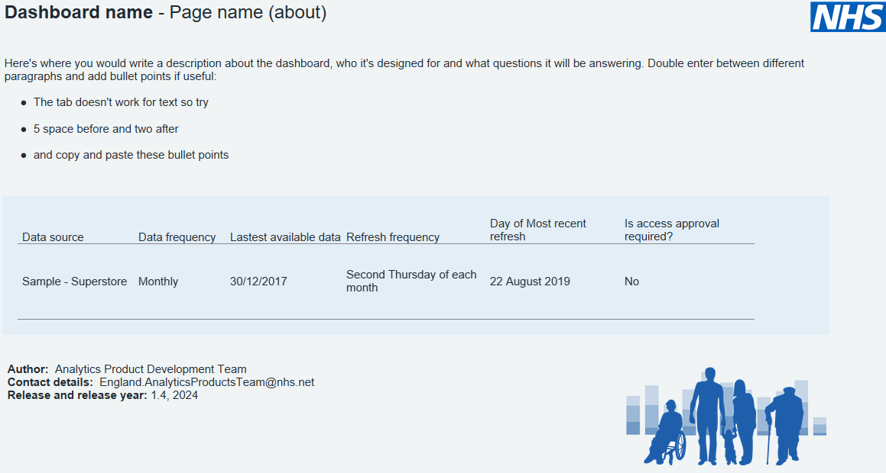

# Style guide rules

## Dashboard layout

Visual Hierarchy is the organisation of design elements by importance. It is best practice to use a Z-formation, which draws the users' attention to the top-left corner first before moving to the top right, then down to the bottom left, and finally the bottom-right corner. Just like how you would read a book.

<!-- Z layout 1 -->

  
1

  
2

  
3

<!-- Z layout 2 -->

  
1

  
2

  
3

<!-- Z layout 3 -->

  
1

  
2

  
3

  
4

For more information on dashboard layouts, [click here](principles.md#visual-hierarchy).

## NHS logo

Always place the NHS logo in the top right hand corner of your dashboard with a 100px width and a 40px height. The padding around the logo is 32px. 

For more information on how to implement the NHS logo in your dashboard, [click here](icons.md#nhs-logo).

{ data-title="NHS logo" data-description=".custom-desc1" data-caption-position="left" data-gallery="icons"}

NHS Logo as shown in the NHS England dashboard templates

## Header and footer

Add a short note below each title to explain what the title is showing. The whole tab should be relevant to your description. If the description is too long, add it to the tooltip in an information icon instead. 

Footers should include the contact information and, if useful, a last refreshed date/time.

For more information on what to include in your dashboard header, [click here](layout.md#header-section).

## Cover page or About page

{ data-title="About page" data-description=".custom-desc1" data-caption-position="left" data-gallery="templates"}

Screenshot of the About page from the NHS England Tableau Templates

See the [NHS England Tableau Templates](https://tabanalytics.data.england.nhs.uk/t/Public/views/NHSEnglanddashboardtemplates-full/FAbout?%3Aembed=y&%3Aiid=2&%3AisGuestRedirectFromVizportal=y) for an example of this in practice. 

## Dashboard sizing

???+ success "Default recommended option: 1200px fixed width dashboard"
    - [x] Suitable for a wide range of screen sizes used by a diverse user base
    - [x] Enables better feature development using a full range of Tableau functionality (e.g floating containers for show/hide)
    - [x] Speed improvements in dashboard performance
    - [x] Less development and testing required

???- warning "Valid use case under the right conditions: 1920px fixed width dashboard"
    - [x] Where the user base is entirely analytical
    - [x] Where all screen sizes are known or dashboard is designed for a permanent screen (e.g a control room)
    - Note that users accessing dashboards with smaller monitors will have a horizontal scroll bar and may omit elements of the dashboard. It is recommended to add an information note on the dashboard to explain that it is best viewed on a wide screen monitor (i.e 1920px width at 100% display scaling).

???- warning "Valid use case under the right conditions: 1200px to 1920px width range dashboard"
    - [x] Where the user base is entirely analytical
    - [x] Where a wide range of screen sizes is used by different users
    - This will allow certain visuals such as line charts and bar charts to expand to monitors that are wider. This benefit must be weighed against the performance trade off of slower load times, more development/testing and reduced Tableau functionality in responsive range dashboards 

For more information on sizing, [click here](layout.md#dashboard-sizing-device-layouts).

## Case

Dashboard titles and Tabs should be in sentence case, which means only the first letter of each sentence should be capitalised. 

Workbook names should be in title case, which means that the first letter of each key word should be capitalised. The small, minor words such as *in, of, with, at, and,* etc should be in lower case.

For more information on typography, [click here](typography.md).

## Font

Use Arial as your primary typeface, no smaller than 10pt. Utilise various weights to establish a visual hierarchy. Be consistent in size, boldness and colour.

Here is a summary of the most important dashboard objects and their font specification that you must use in your dashboard:

| **Objects**                  | **Font** | **Weight** | **Size**    | **Colour**     | **HEX**      | **Alignment** |
|------------------------------|----------|------------|-------------|----------------|--------------|---------------|
| Dashboard title              | Arial    | Bold       | 18pt / 24px | NHS Black      | #212B32       | Left          |
| Chart / card heading                | Arial    | Bold       | 12pt / 16px | NHS Black      | #212B32       | Left          |
| Filter title                 | Arial    | Bold    | 11pt / 15px | NHS Black     | #212B32       | Left          |
| Description / paragraph      | Arial    | Regular    | 11pt / 15px | NHS Black     | #212B32       | Left          |

To see the full font specification, please [click here](typography.md#font-specification).

## Alignment

Right align numbers.

Left align text.

## Filters

Place filters horizontally under the dashboard title and introduction.

Filter titles should be in Arial black. They do not need to have a colon after the label and say 'Choose'.

For more information on filters best practice, [click here](filters.md).

## Colours

<h3 style="display: flex; justify-content: center; align-items: center;">Use NHS Blue</h3>

<b>NHS Blue</b>

<b>RGB: 0 / 94 / 184</b>

<b>#005EB8</b>

<h3 style="display: flex; justify-content: center; align-items: center;">Use lots of White</h3>

<b>NHS White</b>

<b>RGB: 255 / 255 / 255</b>

<b>#FFFFFF</b>

  
  

When using colour to plot multiple variables on a chart, use these colours **strictly in this order**:
 

<table style="border-radius: 10px; background-color: #f0f4f5;">
  <colgroup>
    <col style="background-color:#f0f4f5; width: 10%;">
    <col style="background-color:#005EB8; width: 7.5%;">
    <col style="background-color:#41B6E6; width: 7.5%;">
    <col style="background-color:#4C6272; width: 7.5%;">
    <col style="background-color:#FfB81C; width: 7.5%;">
    <col style="background-color:#AE2573; width: 7.5%;">
    <col style="background-color:#00A499; width: 7.5%;">
    <col style="background-color:#E317AA; width: 7.5%;">
    <col style="background-color:#007F3B; width: 7.5%;">
    <col style="background-color:#9A6324; width: 7.5%;">
    <col style="background-color:#78BE20; width: 7.5%;">
    <col style="background-color:#ED4F00; width: 7.5%;">
    <col style="background-color:#880FB8; width: 7.5%;">
  </colgroup>
<tbody>
  <tr>
    <td NOWRAP>One colour chart</td>
    <td class="table-font">#005EB8</td>
  </tr>
  <tr>
    <td NOWRAP>Two colour chart</td>
    <td></td>
    <td class="table-font" style="color: black">#41B6E6</td>
  </tr>
  <tr>
    <td NOWRAP>Three colour chart</td>
    <td></td>
    <td></td>
    <td class="table-font">#4C6272</td>
  </tr>
  <tr>
    <td NOWRAP>Four colour chart</td>
    <td></td>
    <td></td>
    <td></td>
    <td class="table-font" style="color: black">#FFB81C</td>
  </tr>
  <tr>
    <td NOWRAP>Five colour chart</td>
    <td></td>
    <td></td>
    <td></td>
    <td></td>
    <td class="table-font">#AE2573</td>
  </tr>
  <tr>
    <td NOWRAP>Six colour chart</td>
    <td></td>
    <td></td>
    <td></td>
    <td></td>
    <td></td>
    <td class="table-font">#00A499</td>
  </tr>
   <tr>
    <td NOWRAP>Seven colour chart</td>
    <td></td>
    <td></td>
    <td></td>
    <td></td>
    <td></td>
    <td></td>
    <td class="table-font">#E317AA</td>
  </tr>
  <tr>
    <td NOWRAP>Eight colour chart</td>
    <td></td>
    <td></td>
    <td></td>
    <td></td>
    <td></td>
    <td></td>
    <td></td>
    <td class="table-font">#007F3B</td>
  </tr>
  <tr>
    <td NOWRAP>Nine colour chart</td>
    <td></td>
    <td></td>
    <td></td>
    <td></td>
    <td></td>
    <td></td>
    <td></td>
    <td></td>
    <td class="table-font">#9A6324</td>
  </tr>
  <tr>
    <td NOWRAP>Ten colour chart</td>
    <td></td>
    <td></td>
    <td></td>
    <td></td>
    <td></td>
    <td></td>
    <td></td>
    <td></td>
    <td></td>
    <td class="table-font">#78BE20</td>
  </tr>
  <tr>
    <td NOWRAP>Eleven colour chart</td>
    <td></td>
    <td></td>
    <td></td>
    <td></td>
    <td></td>
    <td></td>
    <td></td>
    <td></td>
    <td></td>
    <td></td>
    <td class="table-font">#ED4F00</td>
  </tr>
  <tr>
    <td NOWRAP>Twelve colour chart</td>
    <td></td>
    <td></td>
    <td></td>
    <td></td>
    <td></td>
    <td></td>
    <td></td>
    <td></td>
    <td></td>
    <td></td>
    <td></td>
    <td class="table-font">#880FB8</td>
  </tr>
  </tbody>
</table>
 

For more information on which colours you should use and when, [click here](colours.md).