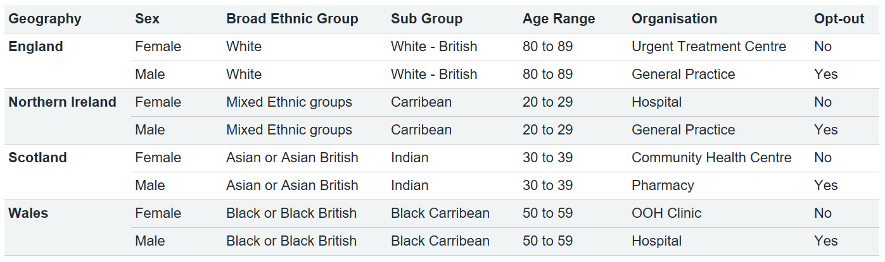

# Table design
Always assess the information you are working with and display it in the clearest style possible. This section demonstrates a number of ways to present information.

## Best practices
???+ tip "Simplicity"
    - [x] Minimal use of borders, with a few line rules to distinguish column headings and totals.
    - [x] White space is used to separate columns.
    - [x] Title and subheadings are in bold so that they stand out.
    - [x] Please ensure there are consistent colours across tabs for tables and charts by using NHS blues, tints and highlight colours.

???- tip "Alignment"
    - [x] **Right align** column headings and numbers in **data tables** (the exception being the first column category title which is left aligned).
    - [x] Right align numbers & figures to better highlight the difference in values at the same level of precision.
    - [x] **Left align** column headings and text in **text tables** for ease of reading.
    - [ ] Don't use centred of variable alignments. Right align to better highlight the difference in values at the same level of precision.

???- tip "Date formats"
    - [x] Use "FY 2017/18" format for financial year. You can bring this from the date dimension during data preparation/
    - [x] Use "Q1 2019" or "Quarter 1, 2019" for date quarters
    - [x] Use "January 2019" or "Jan 19" to display month.
    - [x] Use "4 January 2019", "4 Jan 19" or "04/01/2019" for days.
    - [x] Use "Wednesday, 4 January 2019", "Wednesday" or "Wed" for weekday.

???- tip "Numbers"
    - [x] Always use commas to indicate thousands, millions, billion: £1,234,567.89
    - [x] Always start with zero for values less than 1 (Example: 0.75 not .75)
    - [x] Always use a consistent level of precision within a table
    - [x] Ensure negative values are indicated by a minus sign (Example: -65)
    - [x] Round data in a way to sufficiently convey value and add context to data, but don't oversell confidence in data quality through being too accurate. For example £123,234.59 implies a confidence in the data quality to the nearest penny. Whereas if the data quality is lower, or submitted data is unvalidated, a lower significance level should be give, eg £123,230.
    - [x] Percentages shouldn't be at a greater detail than 1dp unless specifically required
    - [x] Use the lowest possible level of detail depending on the the intended audience

## Thin data tables
- Minimise the data-ink ratio
- Right align column header and numerical values
- Font sizes as in the [typography list](../typography/#font-specification)
- Header text alignment should be vertical middle and right

{ data-title="Thin data tables" data-description=".custom-desc1" data-caption-position="left" data-gallery="tables"}

Example of a thin data table

## Wide data tables
- Shading allows the user to keep their eye on a specific row as they scan from left to right
- Right align column header and numerical values
- 
Table header colour: #F0F4F5

- 
Alternate row colour: #F0F4F5

- 
Text colour: #212B32

{ data-title="Wide data tables" data-description=".custom-desc2" data-caption-position="left" data-gallery="tables"}

Example of a wide data table

## Text tables
- Headers should be left-aligned for the column
- Text in tables should also be left-aligned
- 
Table header colour: #F0F4F5

- 
Alternate row colour: #F0F4F5

- 
Text colour: #212B32

{ data-title="Text tables" data-description=".custom-desc3" data-caption-position="left" data-gallery="tables"}

Example of a text table

## National standards
National standards should be clearly labelled in a table or chart wherever applicable.

 - If multiple metrics with multiple difference national standards are shown, label these in the table

{ width="500px" data-title="National standards table" data-description=".custom-desc4" data-caption-position="left" data-gallery="tables"}

Example of a national standards table

 - To highlight whether national standards are met in a table, colour the text in [RAG colours](colours.md#rag-colours) or add a background 20% RAG colour. 
RAG rating should only be used where there is a national standard being met or not met, otherwise it should not be used.

{width="500px" data-title="National standards table" data-description=".custom-desc5" data-caption-position="left" data-gallery="tables"}

Example of a RAG table

