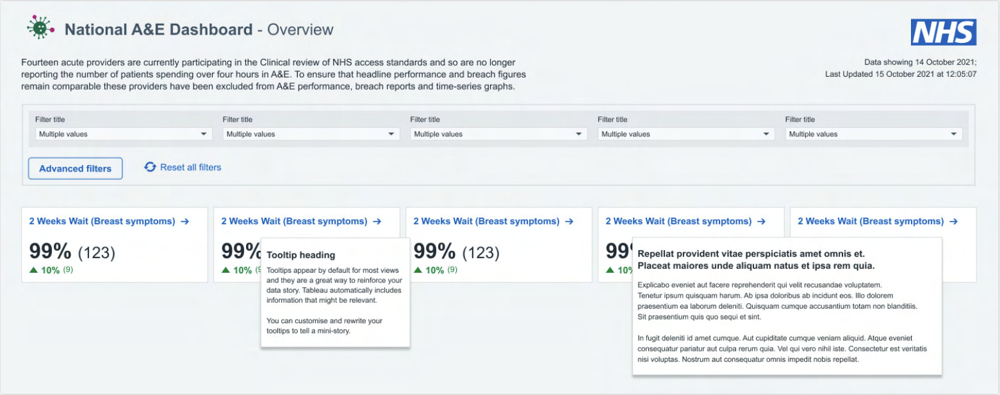

# Tooltips
There are numerous types of tooltips used across the platform and are used to provide more information on a specific area. Tooltips must have a heading and can include supporting text and numbers.

* Tooltip titles should be the most important information a user needs to know
* Ensure that units are included for all numbers in tooltips
* The number of decimal places shown as text on a graph or table should match the decimal places of the value shown in the tooltip. Axis decimal places do not need to match this

## Sizing
If you are showing a visualisation within the tooltip then we suggest its maximum size should be: 710px (width) x 425px (height).

## Keep it simple
Avoid unnecessary words - especially at the start of a tooltip.

Where possible avoid acronyms in the product name, unless widely understood e.g. NHS

If an acronym needs to be included in the product title, ensure it is also written out in full e.g. Summary Emergency Department Indicator Table (SEDIT)

## Other tooltips

Some tooltips will have an information icon  next to the title. Hovering over this  will show a tooltip that provides details on how to use or interpret the visualisation. These tooltips can show supporting text, numbers, data, an image or an annotation.

## Examples
### Without a heading

### With a heading

### Visualisations within a tooltip
Example 1  

Example 2  

