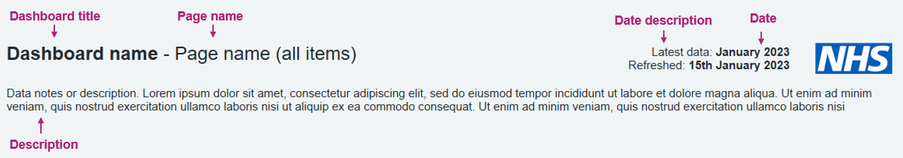
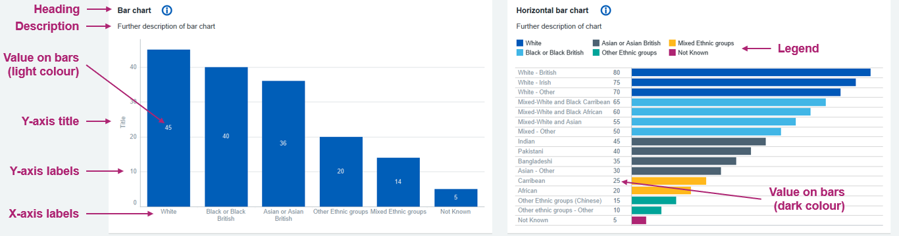
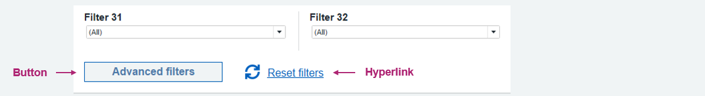

Typefaces are an important element of the NHS identity. The consistent application of NHS typefaces creates a unified brand which patients and the public can trust.

## Fonts
!!! info inline end "Did you know...?"
    Frutiger is the primary typeface of the NHS. However, **Arial should be used in all NHS data products** as Frutiger is not always available!

!!! danger "You must use Arial font"
    - Set your default font to be Arial before starting development
    - Font size should not be smaller than size 10
    <!-- /* cspell:disable-next-line */ -->
    - Use "<ins>S</ins>entence case"  for dashboard titles

## Best practices

???+ success "Typography - Best practices"
    - [x] Use concise language, which is to the point and easy to understand
    - [x] If using acronyms, explain them the first time they appear (or in a tooltip)
    - [x] Use contrast to **emphasise key information** and de-emphasise what is less important
    - [ ] Avoid abbreviations, technical jargon and acronyms where possible
    - [ ] Avoid using large blocks of text, especially when used in combination with charts
    - [ ] Don't go into details of the methods, but perhaps highlight some of the key approaches described below

## Font specification

Here is a summary of the most important dashboard objects and their font specification that you must use in your dashboard:

### Summary

| **Objects**                  | **Font** | **Weight** | **Size**    | **Colour**     | **HEX**      | **Alignment** |
|------------------------------|----------|------------|-------------|----------------|--------------|---------------|
| Dashboard title              | Arial    | Bold       | 18pt / 24px | NHS Black      | #212B32       | Left          |
| Chart / card heading                | Arial    | Bold       | 12pt / 16px | NHS Black      | #212B32       | Left          |
| Filter title                 | Arial    | Bold    | 11pt / 15px | NHS Black     | #212B32       | Left          |
| Description / paragraph      | Arial    | Regular    | 11pt / 15px | NHS Black     | #212B32       | Left          |

### Titles, descriptions, captions and dates

| **Objects**                  | **Font** | **Weight** | **Size**    | **Colour**     | **HEX**      | **Alignment** |
|------------------------------|----------|------------|-------------|----------------|--------------|---------------|
| Dashboard title              | Arial    | Bold       | 18pt / 24px | NHS Black      | #212B32       | Left          |
| Page name in title            | Arial    | Regular    | 18pt / 24px | NHS Black      | #212B32       | Left          |
| Description / Paragraph      | Arial    | Regular    | 11pt / 15px | NHS Black     | #212B32       | Left          |
| Date                         | Arial    | Bold    | 11pt / 15px | NHS Black     | #212B32       | Left          |
| Date description             | Arial    | Regular    | 11pt / 15px | NHS Black     | #212B32       | Left          |
| Caption                      | Arial    | Regular    | 10pt / 13px | NHS Black     | #212B32       | Left          |

### Alert / important update

| **Objects**                  | **Font** | **Weight** | **Size**    | **Colour**     | **HEX**      | **Alignment** |
|------------------------------|----------|------------|-------------|----------------|--------------|---------------|
| Alert / important update       | Arial    | Regular    | 11pt / 15px | NHS Black     | #212B32       | Left          |

### Filters / controls

| **Objects**                  | **Font** | **Weight** | **Size**    | **Colour**     | **HEX**      | **Alignment** |
|------------------------------|----------|------------|-------------|----------------|--------------|---------------|
| Filter / controls heading             | Arial    | Bold       | 12pt / 16px | NHS Black      | #212B32       | Left          |
| Filter / controls title                 | Arial    | Bold    | 11pt / 15px | NHS Black     | #212B32       | Left          |

### KPIs

| **Objects**                  | **Font** | **Weight** | **Size**    | **Colour**     | **HEX**      | **Alignment** |
|------------------------------|----------|------------|-------------|----------------|--------------|---------------|
| Group heading            | Arial    | Bold       | 12pt / 16px | NHS Dark Grey      | #425563       | Left          |
| Heading                  | Arial    | Bold       | 11pt / 15px | NHS Dark Grey      | #425563       | Left          |
| Heading as link          | Arial    | Bold       | 11pt / 15px | NHS Blue       | #005EB8       | Left          |
| Metric                   | Arial    | Bold       | 24pt / 32px | NHS Black      | #212B32       | Left          |
| Metric in brackets       | Arial    | Regular    | 18pt / 24px | NHS Dark Grey      | #425563       | Left 
| Metric decrease          | Arial    | Bold       | 11pt / 15px | NHS Dark Red   | #8A1538       | Left          |
| Metric decrease in brackets | Arial    | Regular    | 11pt / 15px | NHS Dark Red   | #8A1538       | Left          |
| Metric increase          | Arial    | Bold       | 11pt / 15px | NHS Dark Green | #007F3B       | Left          |
| Metric increase in brackets | Arial    | Regular    | 11pt / 15px | NHS Dark Green | #007F3B       | Left          |

### Charts

| **Objects**                  | **Font** | **Weight** | **Size**    | **Colour**     | **HEX**      | **Alignment** |
|------------------------------|----------|------------|-------------|----------------|--------------|---------------|
| Heading                | Arial    | Bold       | 12pt / 16px | NHS Black      | #212B32       | Left          |
| Description      | Arial    | Regular    | 11pt / 15px | NHS Black     | #212B32       | Left          |
| Legends                      | Arial    | Regular    | 10pt / 13px | NHS Black     | #212B32       | Left          |
| X-axis / Y-axis labels       | Arial    | Regular    | 10pt / 13px   | NHS Grey 3     | #768692       | Centre        |
| X-axis / Y-axis titles    | Arial    | Regular    | 10pt / 13px  | NHS Grey 1     | #4C6272       | Centre        |
| Value on bars (light colour) | Arial    | Regular    | 10pt / 13px  | NHS Grey 5     | #F2F2F2       | Centre        |
| Value on bars (dark colour)  | Arial    | Regular    | 10pt / 13px  | NHS Grey 1     | #4C6272       | Centre        ||

### Tables

| **Objects**                  | 
**Font**
  | 
**Weight**
  | 
**Size**
     | 
**Colour**
     | 
**HEX**
      | 
**Alignment**
|
|------------------------------|----------|------------|-------------|----------------|--------------|---------------|
| Heading                | Arial    | Bold       | 12pt / 16px  | NHS Black      | #212B32       | Left          |
| Description            | Arial    | Regular    | 11pt / 15px | NHS Black     | #212B32       | Left          |
| Column heading         | Arial    | Bold       | 11pt / 15px | NHS Black     | #212B32       | Right (the exception being the first column category title which is left aligned)          |
| Column sub-heading     | Arial    | Bold       | 11pt / 15px  | NHS Black     | #212B32       | Right (the exception being the first column category title which is left aligned          |
| Row heading            | Arial    | Bold       | 11pt / 15px  | NHS Black     | #212B32       | Left          |
| Body / rows            | Arial    | Regular    | 11pt / 15px  | NHS Black     | #212B32       | Left          |

### Tooltips

| **Objects**                  | **Font** | **Weight** | **Size**    | **Colour**     | **HEX**      | **Alignment** |
|------------------------------|----------|------------|-------------|----------------|--------------|---------------|
| Heading              | Arial    | Bold       | 12pt / 16px | NHS Black      | #212B32       | Left          |
| Description          | Arial    | Regular    | 11pt / 15px | NHS Black      | #212B32       | Left          |

### Hyperlinks and buttons

| **Objects**                  | **Font** | **Weight** | **Size**    | **Colour**     | **HEX**      | **Alignment** |
|------------------------------|----------|------------|-------------|----------------|--------------|---------------|
| Button                  | Arial    | Bold       | 12pt / 16px | NHS Blue       | #005EB8       | Left           |
| Hyperlink                    | Arial    | Underlined    | 12pt / 16px | NHS Blue       | #005EB8       | Left          |