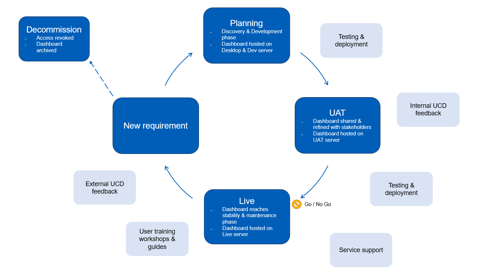

# Dashboard Lifecycle

## Lifecycle with user groups

## Lifecycle (light touch)

## Dashboard purpose

You should think about the following questions before designing a dashboard:

{ data-title="Information / about page" data-description=".custom-desc1" data-caption-position="left" data-gallery="information"}

Questions to consider before designing a dashboard

If a dashboard is right for your project, consider it from the users perspective. Who are they? Could they benefit from a detailed report or one easy to read page? Think about the questions that each page will be answering and who would be asking the question. 